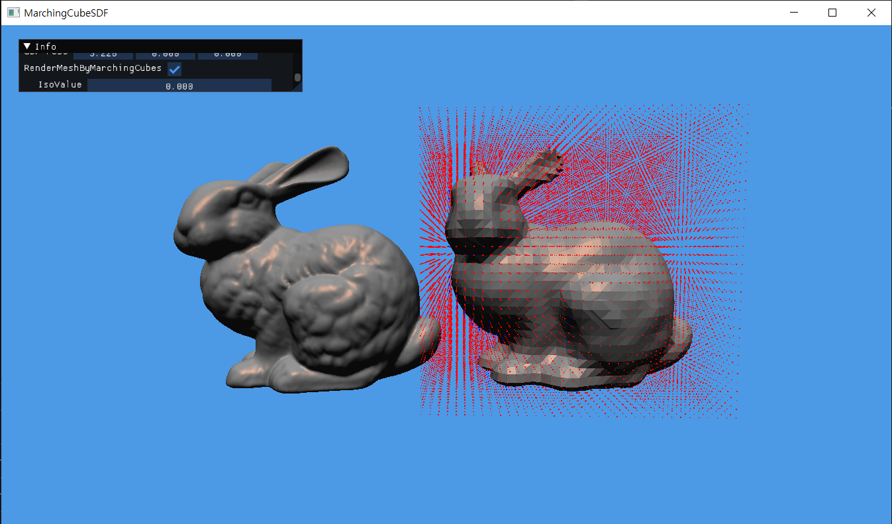

# MarchingCubeSDF (Using OpenGL)


I write this application for studying how to calculate SDF values from a mesh and render it with marching cube algorithm by OpenGL API. Therefore, this application is only for practice and is not optimized at all.

I support debugging rendering options for marching cube algorithm to see what's going on. However the debugging rendering code is also very slow.

When loading a obj file for the SDF values, adjust `model_scale` and `grid_delta`. `grid_init2` or `grid_init` codes calculate the number of grid points with them. If you don't adjust, the number of grid points may become large and cause the application to crash.

As for calculating SDF values, I use a AABB tree whose leaf contains a triangle from a mesh. I query a closest triangle for a grid point through the BVH structure (AABB tree). After getting a closest triangle for a query (grid) point, you also know the closest point on the triangle from the query point. The vector from the closest point to the query point is used with the triangle normal to see whether the grid point is in the true plane of a triangle or not. If it's true plane, the query point is outside, which means the sdf value is positive. Otherwise, the sdf value is negative (inside). I am using my ThreadPool implementation to accelerate this process more.

There will be no updates on this repository. Enjoy Graphics!


# How to Build (tested only on Windows)

I am using CMake to build a Visual Studio Project for this.

On this repository, create a build folder and then move to the build folder:

```
mkdir build
cd build
```

Type a CMake command to create a Visual Studio project

```
cmake ../ -G "Visual Studio 17 2022" -A x64
```

Now you can see `MarchingCubeSDF.sln` file. After opening the project, you have to build `INSTALL` project first to move resource files (shader and obj files) to the executable file. After that, you can see the original bunny and the SDF bunny.


# Control the application

Basically, I support a FPS camera on the application. You can use WASD to move around and use dragging to rotate the camera view. You can do whatever you want more at `camera_update()` function on `camera.cpp`.

I integrate the Dear ImGui library into my application so that you can control some options. You can interact with it on the application and do your things at `app_gui()` function on `main.cpp`.


# Reference

* **Matrin Cavarga**'s Blog and github repository: He wrote many blog posts about calculating SDF values with advanced algorithms. It was really helpful for me to study with his blog. Even He provides his code on the github respoistory. I didn't implement all the advanced  algorithms.
  * [Implementing Your Own Metaballs and Meta-Objects](https://mshgrid.com/2020/02/03/implementing-your-own-metaballs-and-meta-objects/)
  * [AABB Tree](https://mshgrid.com/2021/01/17/aabb-tree/)
  * [Octree for Voxel Outlines of a Triangular Mesh](https://mshgrid.com/2021/01/19/octree-for-voxel-outlines-of-a-triangular-mesh/)
  * [The Fast Sweeping Algorithm](https://mshgrid.com/2021/02/04/the-fast-sweeping-algorithm/)
  * [Computing the Sign of Discrete Distance Fields](https://mshgrid.com/2021/02/07/computing-the-sign-of-discrete-distance-fields/)
  * [Repository](https://github.com/MCInversion/MCInversionPhDCollection/tree/main)
* Paul Bourke's Blog: my marching cubes code is just a copy of his blog code. He introduces the algorithm of marching cubes with his codes. He even gives you the table values necessary to implement the marching cubes. I just ported his code into my app with OpenGL API.
  * [Polygonising a scalar field](https://paulbourke.net/geometry/polygonise/)
* I additionally recommend to see [libigl](https://libigl.github.io/tutorial/#signed-distances)'s tutorial and code. Their code also provides SDF calculation.
* Geometry algorithms from Real-Time Collision Detection by Christer Ericson.
  * `triangle_closest_point`
  * `triangle_intersect_ray`
* AABB tree construction from [godot](https://github.com/godotengine/godot).

* [glad](https://github.com/Dav1dde/glad)
* [glfw](https://github.com/glfw/glfw)
* [Dear ImGui](https://github.com/ocornut/imgui)
* [tinyobjloader](https://github.com/tinyobjloader/tinyobjloader)
* [glm](https://github.com/g-truc/glm)
